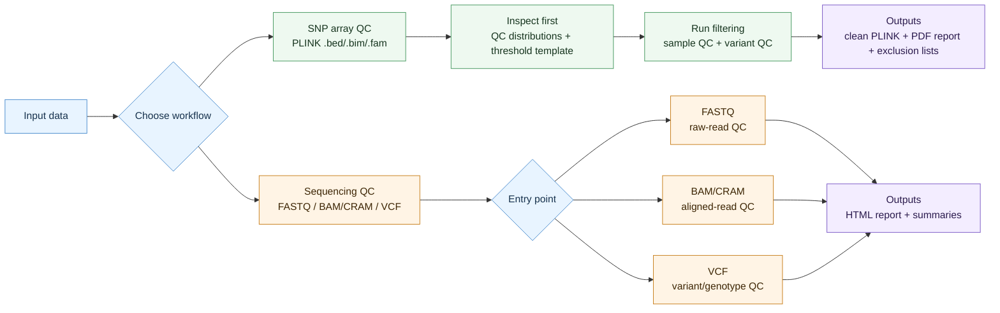

# ByeGenoQC

[](https://github.com/kaiyao28/ByeGenoQC/actions/workflows/ci-smoke-tests.yml)
[](https://github.com/kaiyao28/ByeGenoQC/pkgs/container/byegenoqc)
[](https://www.nextflow.io/)
[](LICENSE)

**Reproducible genetic QC for SNP arrays and sequencing-derived data.**

ByeGenoQC is a modular Nextflow DSL2 workflow collection for genetic quality control. It provides SNP-array QC workflows, sequencing QC entry points, containerized execution, and reports that record the files, thresholds, and QC summaries used in a run.

## What It Does

- SNP-array inspect-first QC to review metric distributions before filtering.
- SNP-array sample and variant filtering with auditable exclusion lists.
- FASTQ, BAM/CRAM, and VCF sequencing QC entry points.
- Containerized Docker/Singularity execution for local and HPC environments.
- Reports, attrition tables, summaries, and threshold records for review.

## How It Works



The repository currently provides workflows for two broad data types:

| Workflow | Inputs | Outputs |
|----------|--------|---------|
| `snp_array_qc/` | PLINK binary (`.bed/.bim/.fam`) | Clean PLINK files, PDF report, thresholds, attrition tables, exclusion lists |
| `wgs_wes_qc/` | FASTQ, BAM/CRAM, or VCF | HTML report, input/QC summaries, filtered/indexed VCF outputs where applicable |

Run the demo smoke tests:

```bash
git clone https://github.com/kaiyao28/ByeGenoQC.git
cd ByeGenoQC
bash test_data/run_smoke_tests.sh
```

For setup help, start with the [Setup Guide](docs/setup.md). For documentation by task, see the [Documentation Index](docs/index.md).

The SNP-array workflow performs array sample and variant QC. The sequencing workflow has separate entry points: FASTQ mode performs raw-read QC only, BAM/CRAM mode performs sequencing sample QC on aligned reads, and VCF mode performs variant/genotype QC on called variants. It does not perform alignment, variant calling, or joint genotyping from FASTQ input. QC modules can be toggled independently, and thresholds can be overridden from the command line.

For SNP array data, the recommended workflow has two stages: **inspect first, then filter**. The inspection step (`inspect.nf`) computes metric distributions on unfiltered data and produces an annotated `params_template.yaml` to support dataset-specific threshold selection before samples or variants are removed. The QC step (`main.nf`) then applies the selected thresholds.

The outputs are intended to make QC decisions easier to audit: reports include attrition tables, QC summaries, and the thresholds used. They should still be reviewed in the context of the study design, assay type, ancestry composition, and downstream analysis plan.

---

## Pipeline Overview

<!-- DAG diagrams generated with: nextflow run <workflow> -with-dag assets/<name>_dag.png -preview -->

| Workflow | DAG |
|----------|-----|
| SNP Array QC | Generated as `assets/snp_array_dag.png` |
| Sequencing QC entry points | Generated as `assets/wgs_dag.png` |

To regenerate the diagrams:

```bash
# SNP array
nextflow run snp_array_qc/main.nf \
  --bfile test_data/snp_array/toy \
  --run_variant_qc true \
  --run_sample_qc true \
  --run_final_report true \
  --outdir results/dag_test \
  -profile docker \
  -with-dag assets/snp_array_dag.png \
  -preview

# Sequencing QC entry point (VCF mode)
nextflow run wgs_wes_qc/main.nf \
  --input_type vcf \
  --samplesheet test_data/wgs_wes/samplesheet_vcf.csv \
  --reference_fasta test_data/reference/mini.fa \
  --mode wgs \
  --chroms 22 \
  --run_variant_qc true \
  --run_sample_qc false \
  --run_final_report true \
  --outdir results/dag_test \
  -profile docker \
  -with-dag assets/wgs_dag.png \
  -preview
```

---

## Quick Start

```bash
git clone https://github.com/kaiyao28/ByeGenoQC.git
cd ByeGenoQC
bash test_data/run_smoke_tests.sh                    # all three tests
bash test_data/run_smoke_tests.sh --test snp_array   # SNP array: variant QC only
bash test_data/run_smoke_tests.sh --test snp_full    # SNP array: full QC (variant + sample)
bash test_data/run_smoke_tests.sh --test wgs_wes     # sequencing VCF smoke test
bash test_data/run_smoke_tests.sh --resume           # local debugging only
```

The smoke test script checks Docker and Nextflow, pulls the image, and runs the selected workflow(s) on synthetic toy data in `test_data/`. All tests should complete in a few minutes and write reports to `results/`.
By default, smoke tests run without Nextflow `-resume`; CI uses this fresh mode so cached work cannot hide process-execution regressions.

For HPC without Docker or Singularity, use `--profile manual_paths` instead (see [Setup Guide](docs/setup.md)).

For platform-specific setup (Windows/WSL, Linux, macOS, HPC), see [Setup Guide](docs/setup.md).

---

## Testing Status

ByeGenoQC includes lightweight CI checks and toy-data smoke tests intended to catch common regressions in workflow wiring, parser behaviour, expected output generation, and selected QC triggers.

Current automated checks cover:

- Bash syntax, high-confidence ShellCheck findings, GitHub Actions YAML parsing, and lightweight Nextflow config/workflow previews.
- SNP-array variant-only smoke testing on synthetic PLINK data.
- SNP-array sample + variant QC smoke testing on synthetic data with designed triggers for missingness, relatedness, heterozygosity, and sex-check discordance.
- Sequencing VCF-mode smoke testing on a tiny chromosome 22 VCF, including checks for core VCF outputs, reports, and summary files.
- A negative WGS/WES samplesheet parser regression check for duplicate sample IDs.

These tests are useful for development and CI regression detection, but they are not clinical, regulatory, or dataset-wide validation. Users should validate thresholds, reference data, and outputs for their own cohort and analysis context.

---

## Docker Images

The default release image is pinned in `nextflow.config`:

```text
ghcr.io/kaiyao28/byegenoqc:1.1.0
```

For strict reproducibility, record the image tag or digest used with each run. To use a CI image built from a specific commit, pass its SHA tag:

```bash
nextflow run snp_array_qc/main.nf \
  --bfile data/raw/genotypes \
  --docker_image ghcr.io/kaiyao28/byegenoqc:sha-<git-sha> \
  -profile docker
```

To test a local image:

```bash
docker build -t byegenoqc:local -f containers/Dockerfile .
GENETIC_QC_DOCKER_IMAGE=byegenoqc:local bash test_data/run_smoke_tests.sh --profile docker --test snp_array
```

The legacy image name `ghcr.io/kaiyao28/genetic-qc` is still published for compatibility, but new commands should use `ghcr.io/kaiyao28/byegenoqc`.

---

## Example: SNP Array QC

### Step 1 - Inspect your data first

```bash
nextflow run snp_array_qc/inspect.nf \
  --bfile data/raw/genotypes \
  --outdir results/inspect \
  -profile docker
```

Open `results/inspect/inspect_report.html` in a browser. It shows the full distribution of every QC metric: missingness, MAF, HWE p-values, heterozygosity, pairwise IBD, and PCA, with the default thresholds marked. The file `results/inspect/params_template.yaml` is pre-filled with all parameters and annotated with the observed statistics from your dataset:

```yaml
sample_missingness: 0.02  # observed 95th pct=0.003, max=0.018; very clean; could tighten to 0.01
hwe_p: 1.0e-6             # observed min p (autosomes)=3.2e-12, variants below 1e-6: 125
relatedness_pi_hat: 0.1875
# IBD pairs > 0.1875 (default):  12
# IBD duplicates/MZ twins:        1
```

Edit any threshold that looks wrong for your data, then fill in optional inputs:

```yaml
reference_panel: data/1000G/1000G_hg38   # for ancestry-labelled PCA
ld_regions: data/high_ld_hg19.txt        # recommended: exclude MHC and inversions
```

### Step 2 - Run QC

```bash
nextflow run snp_array_qc/main.nf \
  -params-file results/inspect/params_template.yaml \
  -profile docker
```

If you are confident the defaults are appropriate and want to skip the inspection step:

```bash
nextflow run snp_array_qc/main.nf \
  --bfile data/raw/genotypes \
  --outdir results/snp_array_qc \
  -profile docker
```

Full parameter reference: [SNP Array QC Manual](docs/snp_array_qc_manual.md)

---

## Example: Sequencing QC Entry Points

### FASTQ input: raw-read QC only

FASTQ mode validates input files and runs FastQC when `--run_sample_qc true`. It does not align reads or call variants.

```bash
nextflow run wgs_wes_qc/main.nf \
  --input_type fastq \
  --samplesheet samplesheet.csv \
  --reference_fasta /data/reference/GRCh38.fa \
  --mode wgs \
  --outdir results/fastq_qc \
  -profile docker
```

### BAM/CRAM input: aligned-read sample QC

BAM/CRAM mode expects already aligned and indexed files. It can run alignment metrics, duplicate metrics, coverage QC, contamination estimation, and sex check. It does not call variants.

```bash
nextflow run wgs_wes_qc/main.nf \
  --input_type bam \
  --samplesheet samplesheet.csv \
  --reference_fasta /data/reference/GRCh38.fa \
  --target_intervals /data/reference/exome_targets.bed \
  --mode wes \
  --outdir results/wgs_wes_qc \
  -profile docker
```

### VCF input: variant and genotype QC

VCF mode expects called variants. It can run variant statistics/filtering, merge chromosome-scoped VCFs, sample genotype counts, relatedness, and ancestry PCA. It does not perform read-level QC.

```bash
nextflow run wgs_wes_qc/main.nf \
  --input_type vcf \
  --samplesheet samplesheet.csv \
  --reference_fasta /data/reference/GRCh38.fa \
  --mode wgs \
  --run_variant_qc true \
  --outdir results/vcf_qc \
  -profile docker
```

Full parameter reference: [WGS/WES QC Manual](docs/wgs_wes_qc_manual.md)

### Sequencing samplesheet columns

All WGS/WES entry points use CSV samplesheets with a required unique, non-empty `sample` column. Quoted CSV fields are supported.

| `--input_type` | Accepted input columns |
|----------------|------------------------|
| `fastq` | `file1` or `fastq1`; optional read 2 in `file2` or `fastq2` |
| `bam` | `file1` or `bam`; optional index in `file2`, `index`, or `bai` |
| `cram` | `file1`, `cram`, or legacy `bam`; optional index in `file2`, `index`, or `crai` |
| `vcf` | `file1` or `vcf` |

BAM/CRAM indexes are required. If no explicit index column is provided, the workflow checks standard `.bai` or `.crai` paths next to the alignment file. Rows with columns populated for a different `--input_type` fail validation to avoid ambiguous interpretation.

---

## Reports

See [example outputs](docs/example_outputs/README.md) for smoke-test report and table paths.

**SNP Array report** (`06_report/qc_report.pdf`):

| Metric | Value |
|--------|-------|
| Final samples | 950 |
| Final variants | 487 203 |
| Excluded samples | 12 |
| Excluded variants | 4 891 |

Followed by a per-step attrition table showing variants and samples removed at each QC filter (duplicate check, missingness, HWE, MAF, sex check, heterozygosity, relatedness, PCA), and a thresholds table recording all parameter values used.

**Sequencing QC report** (`wgs_wes_final_report.html`):

| Phase | Step | Metric | Value |
|-------|------|--------|-------|
| input_check | input_check | status | PASS |
| variant_level_qc | variant_calling_qc | ts_tv_ratio | 2.07 |
| variant_level_qc | variant_calling_qc | n_snps | 4 812 301 |
| variant_level_qc | variant_calling_qc | n_indels | 891 204 |
| variant_level_qc | merge_chromosomes | n_variants | 5 703 505 |
| sample_level_qc | coverage_qc | mean_depth | 34.2 |
| sample_level_qc | contamination | freemix | 0.009 |

Followed by thresholds and run settings. The report records which phases ran and which were skipped. Available rows depend on `--input_type`: FASTQ reports raw-read QC, BAM/CRAM reports aligned-read sample QC, and VCF reports variant/genotype QC.

---

## Execution Profiles

| Profile | When to use |
|---------|-------------|
| `docker` | Laptop or workstation with Docker Desktop |
| `slurm,singularity` | HPC cluster with SLURM + Apptainer/Singularity |
| `lsf,singularity` | HPC cluster with LSF + Apptainer/Singularity |
| `slurm,manual_paths` | HPC with no container engine; tools installed manually |

On HPC, always pair the scheduler profile (`slurm`, `lsf`) with the container profile (`singularity`). `-profile singularity` alone runs on the login node. Use absolute paths for `--bfile` and `--outdir` on clusters; relative paths can fail silently on compute nodes.

If no container engine is available, run `bash setup_hpc_manual.sh` first to download all tools. See [Setup Guide](docs/setup.md) for full cluster instructions.

---

## Key Thresholds

All thresholds have defaults and can be overridden on the command line:

```bash
# SNP array
--maf 0.05  --hwe_p 1e-4  --sample_missingness 0.05

# Sequencing QC
--min_mean_depth_wgs 30  --max_contamination 0.02  --min_gq 30
```

---

## Documentation

For the full documentation map, see [docs/index.md](docs/index.md).

| Need | Read |
|------|------|
| Install and choose an execution profile | [Setup Guide](docs/setup.md) |
| Run SNP-array inspect-first QC | [SNP Array QC Manual](docs/snp_array_qc_manual.md) |
| Run FASTQ/BAM/CRAM/VCF sequencing QC | [WGS/WES QC Manual](docs/wgs_wes_qc_manual.md) |
| Follow a worked example | [Tutorial](docs/TUTORIAL.md) |
| Understand generated files | [Example Outputs](docs/example_outputs/README.md) |
| Check assumptions and citations | [References](docs/references.md) |

## Repository Map

Most users only need this README, [docs/setup.md](docs/setup.md), and the relevant workflow directory.

```text
ByeGenoQC/
|-- snp_array_qc/      # SNP-array inspect and QC workflows
|-- wgs_wes_qc/        # FASTQ/BAM/CRAM/VCF sequencing QC entry points
|-- conf/              # Docker, Singularity, SLURM, and LSF profiles
|-- containers/        # Docker image definition
|-- test_data/         # synthetic data and smoke-test runner
|-- docs/              # manuals, tutorials, setup, examples
|-- assets/            # DAGs and visual assets
`-- nextflow.config    # default parameters and profiles
```
