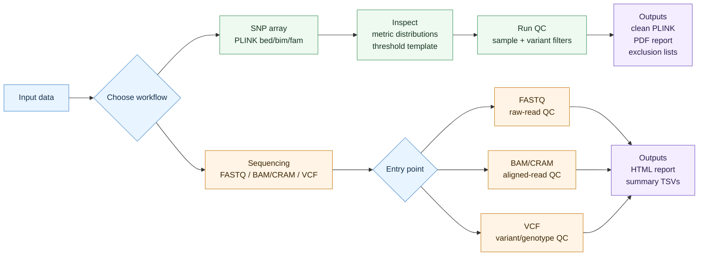

# ByeGenoQC

[](https://github.com/kaiyao28/ByeGenoQC/actions/workflows/ci-smoke-tests.yml)
[](https://github.com/kaiyao28/ByeGenoQC/pkgs/container/byegenoqc)
[](https://www.nextflow.io/)
[](LICENSE)

**Reproducible genetic QC for SNP arrays and sequencing-derived data.**

ByeGenoQC is a modular Nextflow DSL2 workflow collection for genetic quality control. It supports SNP-array QC and sequencing QC entry points for FASTQ, BAM/CRAM, and VCF inputs.

## What It Does

- Inspect-first SNP-array QC with threshold templates.
- SNP-array sample and variant filtering.
- Sequencing QC entry points for FASTQ, BAM/CRAM, and VCF data.
- Docker, Singularity/Apptainer, SLURM, and LSF execution.
- Auditable reports recording thresholds, summaries, and exclusions.

## How It Works



## Supported Workflows

| Workflow | Input | Main output |
|----------|-------|-------------|
| `snp_array_qc/` | PLINK `.bed/.bim/.fam` | clean PLINK files, PDF report, exclusion lists |
| `wgs_wes_qc/` | FASTQ, BAM/CRAM, VCF | QC summaries, HTML report, filtered/merged VCF where applicable |

## Quick Start

```bash
git clone https://github.com/kaiyao28/ByeGenoQC.git
cd ByeGenoQC
bash test_data/run_smoke_tests.sh
```

## Minimal Examples

### SNP Array

```bash
nextflow run snp_array_qc/main.nf \
  --bfile data/raw/genotypes \
  --outdir results/snp_array_qc \
  -profile docker
```

### Sequencing VCF

```bash
nextflow run wgs_wes_qc/main.nf \
  --input_type vcf \
  --samplesheet samplesheet.csv \
  --reference_fasta reference.fa \
  --outdir results/vcf_qc \
  -profile docker
```

## Outputs

| Workflow | Main outputs |
|----------|--------------|
| SNP array | `05_cleaned_data/`, `06_report/qc_report.pdf`, attrition and threshold TSVs, exclusion lists |
| Sequencing | `wgs_wes_final_report.html`, summary TSVs, QC directories, filtered/indexed VCF outputs where applicable |

See [reports](docs/reports.md) and [example outputs](docs/example_outputs/README.md) for more detail.

## Documentation

| Need | Read |
|------|------|
| Install and setup | [docs/setup.md](docs/setup.md) |
| SNP-array workflow | [docs/snp_array_qc_manual.md](docs/snp_array_qc_manual.md) |
| Sequencing workflow | [docs/wgs_wes_qc_manual.md](docs/wgs_wes_qc_manual.md) |
| Detailed examples | [docs/examples/](docs/examples/README.md) |
| Docker images | [docs/docker.md](docs/docker.md) |
| Execution profiles | [docs/execution_profiles.md](docs/execution_profiles.md) |
| Thresholds | [docs/thresholds.md](docs/thresholds.md) |
| Reports | [docs/reports.md](docs/reports.md) |
| Testing | [docs/testing.md](docs/testing.md) |
| Full docs map | [docs/index.md](docs/index.md) |

## Repository Map

```text
ByeGenoQC/
|-- snp_array_qc/      # SNP-array inspect and QC workflows
|-- wgs_wes_qc/        # sequencing QC entry points
|-- conf/              # execution profiles
|-- containers/        # Docker image
|-- docs/              # manuals and examples
|-- scripts/           # setup and release helpers
|-- test_data/         # synthetic data and smoke tests
`-- nextflow.config    # default parameters
```
