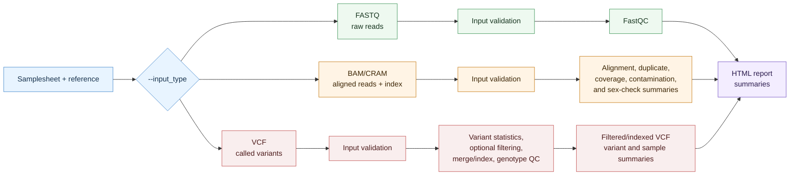

# Sequencing QC Entry Points Manual

## Overview

`wgs_wes_qc/main.nf` provides three sequencing QC entry points. These are not equivalent full end-to-end workflows:

- **FASTQ input** validates raw read files and runs FastQC. It does not align reads, mark duplicates, calculate coverage, call variants, or genotype samples.
- **BAM/CRAM input** expects aligned and indexed reads. It can run aligned-read sample QC: alignment metrics, duplicate metrics, coverage QC, contamination estimation, and sex check. It does not call variants.
- **VCF input** expects already called variants. It can run variant statistics, optional site/genotype filtering, chromosome merge/indexing, per-sample genotype counts, relatedness, and ancestry PCA. It does not inspect FASTQs or BAM/CRAM read-level metrics.

WES and WGS modes share the same entry-point code. In WES mode, `--target_intervals` is required and coverage/depth metrics apply to on-target regions. In WGS mode, no target interval file is required and coverage metrics are interpreted genome-wide.

## Conceptual Flow



## Entry Point Behaviour

| `--input_type` | Required input | Modules that can run | Main outputs |
|----------------|----------------|----------------------|--------------|
| `fastq` | FASTQ R1 with optional R2 | input check, FastQC | `fastqc/`, input summaries, final HTML summary |
| `bam` / `cram` | aligned BAM/CRAM plus index | input check, alignment metrics, duplicate metrics, coverage QC, contamination, sex check | per-sample sequencing QC directories and final HTML summary |
| `vcf` | called VCF | input check, chromosome selection/indexing, variant calling QC statistics, optional variant filtering, merge, sample variant counts, relatedness, PCA | `variant_qc/`, `variant_calling_qc/`, `cleaned_data/`, optional genotype QC summaries, final HTML summary |

FASTQ mode is suitable for pre-alignment read QC. BAM/CRAM mode is suitable for QC of already aligned sequencing data. VCF mode is suitable for QC of already called variants and genotypes.

## Quick Start

### FASTQ Input: Raw-Read QC Only

```bash
nextflow run wgs_wes_qc/main.nf \
  --input_type fastq \
  --samplesheet samplesheet_fastq.csv \
  --reference_fasta reference.fa \
  --mode wgs \
  --outdir results/fastq_qc \
  -profile docker
```

Expected outputs include FastQC HTML/ZIP files, `fastqc_summary.txt`, and the final HTML summary.

### BAM/CRAM Input: Aligned-Read Sample QC

```bash
nextflow run wgs_wes_qc/main.nf \
  --input_type bam \
  --samplesheet samplesheet_bam.csv \
  --reference_fasta data/reference/GRCh38.fa \
  --target_intervals data/reference/exome_targets.bed \
  --mode wes \
  --outdir results/aligned_read_qc \
  -profile docker
```

Expected outputs include alignment, duplicate, coverage, contamination, and sex-check summaries when the corresponding modules are enabled.

### VCF Input: Called-Variant And Genotype QC

```bash
nextflow run wgs_wes_qc/main.nf \
  --input_type vcf \
  --samplesheet samplesheet_vcf.csv \
  --reference_fasta reference.fa \
  --mode wgs \
  --chroms 1-22 \
  --outdir results/vcf_qc \
  -profile docker
```

Expected outputs include variant statistics/filtering summaries, merged/indexed VCF output, sample genotype-count summaries, relatedness/PCA summaries when enabled, and the final HTML report.

## Samplesheet Format

Samplesheets are CSV files with a required `sample` column. Quoted CSV fields are supported. Sample IDs must be non-empty and unique, and every referenced file must exist before the workflow starts.

Supported formats by `--input_type`:

| `--input_type` | Required data columns | Optional columns | Notes |
|----------------|-----------------------|------------------|-------|
| `fastq` | `file1` or `fastq1` | `file2` or `fastq2` | `file2`/`fastq2` is the optional read 2 FASTQ. |
| `bam` | `file1` or `bam` | `file2`, `index`, or `bai` | If no index column is provided, the workflow checks `<bam>.bai` and `<sample>.bai` style paths. |
| `cram` | `file1`, `cram`, or legacy `bam` | `file2`, `index`, or `crai` | If no index column is provided, the workflow checks `<cram>.crai` and `<sample>.crai` style paths. |
| `vcf` | `file1` or `vcf` | none | The VCF may be plain or compressed; downstream modules create indexed working files as needed. |

Rows fail validation if they mix populated columns for another input type, use multiple different values for the same input role, have missing/duplicate sample IDs, or point to missing files.

Generic `file1`/`file2` examples:

```text
sample,file1,file2
SAMPLE001,/data/bams/SAMPLE001.bam,/data/bams/SAMPLE001.bam.bai
SAMPLE002,/data/fastq/SAMPLE002_R1.fastq.gz,/data/fastq/SAMPLE002_R2.fastq.gz
COHORT1,/data/vcf/cohort.vcf.gz,
```

Named-column examples:

```text
sample,fastq1,fastq2
SAMPLE001,/data/fastq/SAMPLE001_R1.fastq.gz,/data/fastq/SAMPLE001_R2.fastq.gz

sample,bam,bai
SAMPLE001,/data/bams/SAMPLE001.bam,/data/bams/SAMPLE001.bam.bai

sample,cram,crai
SAMPLE001,/data/crams/SAMPLE001.cram,/data/crams/SAMPLE001.cram.crai

sample,vcf
COHORT1,/data/vcf/cohort.vcf.gz
```

## Module Reference

### 1. Input Check

**Purpose:** Verify files exist and are indexed where required. Confirm reference FASTA and target intervals are accessible.

**Runs for:** FASTQ, BAM/CRAM, and VCF input.

**Fails if:** Any input file is missing, or target intervals are absent in WES mode.

**Output:** `input_summary.tsv`, `input_check_summary.txt`.

### 2. FastQC

**Purpose:** Assess raw read quality, adapter content, GC content, and duplication patterns for FASTQ input.

**Runs for:** FASTQ input only.

**Tool:** FastQC.

**How to disable:** `--run_fastqc false`.

**Output:** `*.fastqc.html`, `*.fastqc.zip`, `fastqc_summary.txt`.

**Interpretation:** Low per-base quality, high adapter content, or unusual GC content should be reviewed before alignment.

### 3. Alignment Metrics

**Purpose:** Compute mapping rate, properly paired reads, chimeric reads, and insert size distribution for aligned BAM/CRAM input.

**Runs for:** BAM/CRAM input only.

**Tools:** `samtools flagstat`, Picard `CollectAlignmentSummaryMetrics`, Picard `CollectInsertSizeMetrics`.

**How to disable:** `--run_alignment_metrics false`.

**Output:** `flagstat.txt`, `alignment_summary_metrics.txt`, `insert_size_metrics.txt`, `alignment_summary.txt`.

### 4. Duplicate Metrics

**Purpose:** Estimate PCR/optical duplication rate from BAM/CRAM input.

**Runs for:** BAM/CRAM input only.

**Tool:** Picard `MarkDuplicates`.

**Default threshold:** `params.max_duplication_rate = 0.20`.

**How to disable:** `--run_duplicate_metrics false`.

**Output:** duplicate metrics and summary files. This entry point reports duplication metrics; it is not a replacement for a full production alignment/calling workflow.

### 5. Coverage QC

**Purpose:** Estimate mean sequencing depth and coverage fractions for BAM/CRAM input.

**Runs for:** BAM/CRAM input only.

**Tool:** mosdepth.

**Default thresholds:**

- `params.min_mean_depth_wgs = 20`
- `params.min_mean_depth_wes = 30`
- `params.min_target_20x_fraction = 0.80`

**How to disable:** `--run_coverage_qc false`.

**Output:** `coverage_summary.txt`, coverage metrics, optional plots.

### 6. Contamination Check

**Purpose:** Estimate cross-sample contamination from aligned reads.

**Runs for:** BAM/CRAM input only.

**Tool:** VerifyBamID2, with a GATK fallback where configured by the module.

**Default threshold:** `params.max_contamination = 0.03`.

**How to disable:** `--run_contamination false`.

**Output:** contamination result and summary files.

### 7. Sex Check

**Purpose:** Infer biological sex from X and Y chromosome coverage ratios in aligned-read input.

**Runs for:** BAM/CRAM input only.

**How to disable:** `--run_sex_check_wgs false`.

**Output:** `sex_check_results.txt`, `sex_check_summary.txt`.

### 8. Variant Calling QC Statistics

**Purpose:** Compute Ti/Tv ratio, SNP/indel counts, heterozygous/homozygous ratios, and per-sample variant statistics from an existing VCF.

**Runs for:** VCF input only.

**Tool:** `bcftools stats`.

**How to disable:** `--run_variant_calling_qc false`.

**Important:** This module evaluates called variants. It does not perform variant calling.

### 9. Variant Filtering

**Purpose:** Apply site-level and genotype-level filters to an existing VCF.

**Runs for:** VCF input only when `--run_variant_filtering true`.

**Method:** `params.variant_filter_method = "hard_filter"` by default; VQSR requires suitable training resources and a cohort large enough for that method.

**How to disable:** `--run_variant_filtering false`.

### 10. Sample Variant Counts

**Purpose:** Compute per-sample genotype call rate from the VCF and flag samples with low call rate.

**Runs for:** VCF input only when sample-level QC is enabled.

**Default threshold:** `params.min_call_rate = 0.95`.

**How to disable:** `--run_sample_variant_counts false`.

**Output:** `sample_variant_counts.tsv`, `sample_count_outliers.txt`.

### 11. Relatedness

**Purpose:** Detect related or duplicate sample pairs from the VCF.

**Runs for:** VCF input only when sample-level QC is enabled.

**Tool:** `bcftools +relatedness2`.

**Default threshold:** `params.relatedness_pi_hat = 0.1875`.

**How to disable:** `--run_relatedness_wgs false`.

### 12. Ancestry PCA

**Purpose:** Run PCA on high-quality, LD-pruned, common biallelic SNPs extracted from the VCF.

**Runs for:** VCF input only when sample-level QC is enabled.

**Tool:** PLINK2 with `--pca`.

**Default threshold:** `params.pca_outlier_sd = 6`.

**How to disable:** `--run_ancestry_pca_wgs false`.

## Output Structure

```text
results/wgs_wes_qc/
├── fastqc/                    # FASTQ mode only
├── alignment_metrics/         # BAM/CRAM mode only
├── duplicate_metrics/         # BAM/CRAM mode only
├── coverage_qc/               # BAM/CRAM mode only
├── contamination/             # BAM/CRAM mode only
├── sex_check/                 # BAM/CRAM mode only
├── variant_qc/                # VCF mode chromosome outputs
├── variant_calling_qc/        # VCF mode bcftools stats outputs
├── cleaned_data/              # VCF mode merged/filtered VCFs
├── wgs_wes_qc_summary.tsv     # final summary table
├── wgs_wes_thresholds.tsv     # run settings and thresholds
└── wgs_wes_final_report.html  # final HTML report
```

Only directories relevant to the selected `--input_type` are expected.

## Common Issues

| Symptom | Likely cause | Solution |
|---------|--------------|----------|
| FASTQ mode only produces FastQC output | Expected behaviour | Use BAM/CRAM after alignment, or VCF after variant calling, for downstream QC |
| Coverage fails for all BAM/CRAM samples | Wrong target intervals or reference mismatch | Confirm BED coordinate system and reference build |
| Ti/Tv is unexpectedly low in VCF mode | Calling artefacts, wrong reference, or non-standard variant set | Check the upstream caller, reference genome, and VCF contents |
| Low call rate after genotype filter | GQ/DP thresholds too stringent for the data | Consider whether lower thresholds are scientifically justified |
| VQSR fails | Cohort too small or missing resources | Use hard filtering unless VQSR assumptions are met |
